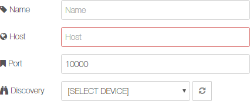
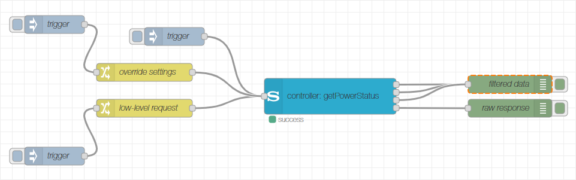
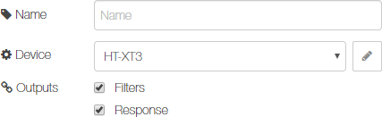
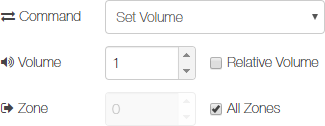
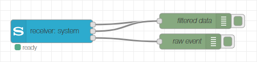
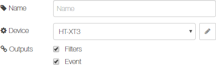
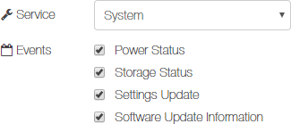
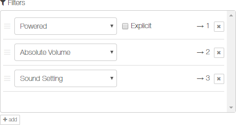

# node-red-contrib-sony-audio
A collection of Node-RED nodes to control Sony audio devices via the Sony Audio Control API.

With these nodes you can connect to your Sony audio devices and send control commands (like powering on/off, change volume etc.), retrieve information (like the current volume, the current value of a sound setting etc.) or get notified of certain events (like a change of the power state, a change of the mute state etc.).

If you would like to propose a new feature or any kind of improvement or if you want to report a bug, don't hesitate to create an issue in the [issue tracker](https://github.com/jensrossbach/node-red-contrib-sony-audio/issues) of the repository on GitHub.

- [Documentation](#documentation)
  - [Controller Node](#controller-node)
  - [Receiver Node](#receiver-node)
- [License](#license)
- [Sony Legal Information](#sony-legal-information)
    - [Trademark](#trademark)
    - [License Audio Control API](#license-audio-control-api)

## Documentation
This package is the successor of the [node-red-contrib-sony-audio-control](https://github.com/jensrossbach/node-red-contrib-sony-audio-control) node collection. It contains new powerful flow nodes providing the same and more functionality and flexibility as the old package.

The node collection consists of two flow nodes and one configuration node. The configuration node stores the network address of your Sony audio device. You have to specify a host name (or IP address) and the port (by default, port 10000 is used). Alternatively you can start a device discovery to search for Sony audio devices in the local network. Press the refresh button on the right side of the discovery dropdown box to start or repeat device discovery. After devices have been found, their IP address, port and friendly name can be taken over into the configuration by selecting an appropriate entry in the dropdown box.



### Controller Node
Node for controlling a Sony audio device via the Audio Control API. The node sends requests to a Sony audio device and provides the returned result. The details of the request can be set via the node's configuration page. All settings (except the filters) can also be programmatically overridden, see input description below.



The node also supports a low-level mode for cases where the built-in commands are not sufficient. Via specific attributes (see input description below), any request supported by the Sony Audio Control API can be sent to the device. See Sony <a href="https://developer.sony.com/develop/audio-control-api/api-references/api-overview-2">Audio Control API</a> reference for more details about the API methods and their parameters.

#### Configuration
On the configuration page, you can configure various settings of the node. Optionally enter a name to be displayed - if omitted, "control: _command_" will be shown as name. You have to select the Sony audio device to talk to from the dropdown box (or create a new device configuration if not yet done). The next two checkboxes control which outputs will be provided by the node. The _Filters_ checkbox enables or disables the group of filter output ports and the _Response_ checkbox enables or disables the response output port. See chapter [Outputs](#outputs) below for more information. The checkbox _Enable Override_ controls if the node interprets the `msg.topic` property as alternative to command or low level request overrides (see chapter [Input](#input) for more information).



The following dropdown box selects the command to send to the device including its parameters. Depending on the selected command, different widgets for configuring the command parameters appear.



Below is a list of supported commands.

> ##### Get Power Status
> Retrieves the current power status of the device.
>
> ##### Power ON
> Switches on power of the device.
>
> ##### Power OFF
> Switches off power of the device (device goes into standby mode).
>
> ##### Get SW-Update Information
> Retrieves information if a firmware update is available for the device.
>
> ##### Get Source
> Retrieves the currently active audio source on a specific zone of the device.
>
> ##### Set Source
> Sets the currently active audio source for a specific zone of the device. In case of a HDMI source, the port can be specified.
>
> ##### Get Volume Information
> Retrieves information about current volume and mute status on a specific zone of the device.
>
> ##### Set Volume
> Sets the current volume for a specific zone of the device. If _Relative Volume_ is checked, the value is a relative volume step, otherwise it is an absolute volume.
>
> ##### Mute
> Mutes the audio output on a specific zone of the device.
>
> ##### Unmute
> Unmutes the audio output on a specific zone of the device.
>
> ##### Toggle Mute
> Toggles between muted and unmuted audio output on a specific zone of the device.
>
> ##### Get Sound Settings
> Retrieves a specific or all current sound settings on the device.
>
> ##### Set Sound Settings
> Sets (if required multiple) sound settings on the device. In the settings list you can add new rows each representing a sound setting. You can choose the setting from the dropdown box and then depending on the selected setting, either turn the setting on or off, or select the setting's value from a second dropdown box.
>
> ##### Get Playback Modes
> Retrieves a specific or all current playback mode settings on the device.
>
> ##### Set Playback Modes
> Sets (if required multiple) playback mode settings on the device. In the settings list you can add new rows each representing a playback mode setting. You can choose the mode type from the dropdown box and then select the mode's value from a second dropdown box.
>
> ##### Stop
> Stops the current audio playback on a specific zone of the device.
>
> ##### Toggle Pause
> Toggles between paused and playing state on a specific zone of the device.
>
> ##### Skip Previous
> Skips to the previous or the beginning of currently playing content on a specific zone of the device.
>
> ##### Skip Next
> Skips to the next content on a specific zone of the device.
>
> ##### Scan Backward
> Scans forward in the currently playing content on a specific zone of the device.
>
> ##### Scan Forward
> Scans backward in the currently playing content on a specific zone of the device.

If the filter output ports are enabled, filters for post processing the response from the device can be configured in the last section. See [Filters](#filters-2) chapter for more information on how to setup the filters.

#### Input
The input message is used to trigger and programmatically configure the controller node. Depending on the provided attributes, either the node's configuration can be overridden or a low-level request can be sent to the Audio Control API.

##### Configuration Overriding
By providing any of the following attributes in the input message, the corresponding settings from the node configuration are overridden.

```javascript
{
    "command": "string",  // overrides selected command
    "payload":
    {
        "source":
        {
            "scheme":   "string",  // overrides selected source
            "resource": "string",  //   -||-
            "port":     "number"   // overrides port number
        },
        "volume":
        {
            "absolute": "number",  // overrides volume ('Relative Volume' unchecked)
            "relative": "number"   // overrides volume ('Relative Volume' checked)
        },
        "settings":  // overrides list of sound or playback mode settings
        [
            {
                "target": "string",  // overrides selected type of sound or playback mode setting
                "value":  "string"   // overrides selected sound or playback mode setting value
            }
        ],
        "target": "string",  // overrides selected sound or playback mode setting to retrieve
        "zone":   "number"   // overrides zone number (0 correponds to 'All Zones' checked)
    }
}
```

If _Enable Override_ in the _Topic_ section is activated, the command can alternatively be overridden via the `msg.topic` property. This is useful if you want to provide the command via an inject node without using a change node (because the inject node can only set `msg.topic` and `msg.payload`).

Only certain combinations are meaningful, see the following table.

|Command|source|volume|settings|target|zone|
|-------|:----:|:----:|:------:|:----:|:--:|
|getPowerStatus| | | | | |
|powerOn| | | | | |
|powerOff| | | | | |
|getSWUpdateInfo| | | | | |
|getSource| | | | |X|
|setSource|X| | | |X|
|getVolumeInfo| | | | |X|
|setVolume| |X| | |X|
|mute| | | | |X|
|unmute| | | | |X|
|toggleMute| | | | |X|
|getSoundSettings| | | |X| |
|setSoundSettings| | |X| | |
|getPlaybackModes| | | |X| |
|setPlaybackModes| | |X| | |
|stop| | | | |X|
|togglePause| | | | |X|
|skipPrev| | | | |X|
|skipNext| | | | |X|
|scanBackward| | | | |X|
|scanForward| | | | |X|

The command _setVolume_ supports a simple alternative to specify the target volume by providing the volume in form of a payload of type 'number'. Use the command suffix (see below) in this case to tell the node if the volume is absolute or relative.

The commands _getPowerStatus_, _getSWUpdateInfo_, _getVolumeInfo_ and _setVolume_ can be extended with a suffix in the form `command:suffix`. The suffix is only relevant when specifying the volume as payload of type 'number' or when using the auto filter in order to tell the filter what to filter for. The following suffixes are supported:

|Command        |Suffix         |Description                               |
|---------------|---------------|------------------------------------------|
|getPowerStatus |n/a            |Filter for powered status                 |
|getPowerStatus |powered        |Filter for powered status                 |
|getPowerStatus |poweredExplicit|Filter for powered status (explicit)      |
|getPowerStatus |standby        |Filter for standby status                 |
|getPowerStatus |standbyExplicit|Filter for standby status (explicit)      |
|getSWUpdateInfo|n/a            |Filter for software update info           |
|getSWUpdateInfo|explicit       |Filter for software update info (explicit)|
|getVolumeInfo  |n/a            |Filter for absolute volume                |
|getVolumeInfo  |absolute       |Filter for absolute volume                |
|getVolumeInfo  |relative       |Filter for relative volume                |
|getVolumeInfo  |muted          |Filter for mute status                    |
|setVolume      |absolute       |Payload contains absolute volume          |
|setVolume      |relative       |Payload contains relative volume          |

For more details to the input message attributes, please also check the [Filters](#filters-2) chapter further down.

##### Low-Level Request
To send a low-level request to the Audio Control API, i.e. a request which is directly understood by the device, the following attributes according to the Sony Audio Control API specification are required in the input message.

```javascript
{
    "service": "string",  // the API service of the request
    "method":  "string",  // the API method of the request
    "version": "string",  // the API version of the request
    "payload":
    {
        ...  // the parameters of the request
    }
}
```

If _Enable Override_ in the _Topic_ section is activated, the service, method and version can alternatively be overridden via the `msg.topic` property. This is useful if you want to provide the request via an inject node without using a change node (because the inject node can only set `msg.topic`and `msg.payload`). The topic must be provided in the form `service`/`method`/`version`.


For more information on how to form a request, please refer to the Sony [Audio Control API](https://developer.sony.com/develop/audio-control-api/api-references/api-overview-2) reference. There is no need to encapsulate the payload into an array, this is automatically done by the node. For methods that do not have parameters, the `msg.payload` must be set to `null`.

##### Examples
```javascript
// set absolute volume to 12 on zone 2 (via command)
{
    "command": "setVolume",
    "payload":
    {
        "volume":
        {
            "absolute": 12
        },
        "zone": 2
    }
}

// set source to HDMI port 4 (via command using topic)
{
    "topic": "setSource",
    "payload":
    {
        "source":
        {
            "scheme": "extInput",
            "resource": "hdmi",
            "port": 4
        }
    }
}

// pause playback on zone 1 (via low-level request)
{
    "service": "avContent",
    "method": "pausePlayingContent",
    "version": "1.1",
    "payload":
    {
        "output": "extOutput:zone?zone=1"
    }
}

// get sound setting for clearAudio (via low-level request using topic)
{
    "topic": "audio/getSoundSettings/1.1",
    "payload":
    {
        "target": "clearAudio"
    }
}
```

#### Outputs
The node provides a variable number of output ports depending on the configuration. There is one output port for the raw response as well as a variable number of outputs depending on the filter configuration. Any errors occurring during execution of the node can be handled using a catch node.

##### Filters
If enabled, the filter output ports provide filtered result data according to the configured filters. The number of filter output ports is determined by the number of filters whereat each filter gets a dedicated output assigned. When there is a response from the device arriving and a filter matches (i.e. it can handle the method of the request), it will process the response and send a message with filtered data on its dedicated output. If multiple filters match the response, there will be multiple output messages sent. The filtered data is contained in the `msg.payload` of the output messages, see [Filters](#filters-2) chapter for a description of the message format.

##### Response
If enabled, the response output port provides the raw / low-level response as sent by the Audio Control API in case the node's operation succeeded. The message has the following format:

```javascript
{
    "service": "string",  // the API service of the request
    "method":  "string",  // the API method of the request
    "version": "string",  // the API version of the request
    "payload":
    {
        ...  // the result data of the request
    }
}
```

### Receiver Node
Notifies an event from a Sony audio device via the Sony Audio Control API. The node listens for notifications and provides the event data upon reception. The service to listen to can be set via the node's configuration page.



#### Configuration
On the configuration page, you can configure various settings of the node. Optionally enter a name to be displayed - if omitted, "receiver: _service_" will be shown as name. Next you must select the Sony audio device to listen to. The following two checkboxes control which outputs will be provided by the node. The _Filters_ checkbox enables or disables the group of filter output ports and the _Event_ checkbox enables or disables the event output port. See chapter [Outputs](#outputs-1) below for more information.



The next dropdown box selects the service to bind to. Depending on the selected service, different checkboxes for the available events appear. Each checkbox allows to subscribe to the corresponding notification.



If the filter output ports are enabled, filters for post processing the notification from the device can be configured in the last section. See [Filters](#filters-2) chapter for more information on how to setup the filters.

#### Input
The node has no input ports.

#### Outputs
The node provides a variable number of output ports depending on the configuration. There is one output port for the raw event data as well as a variable number of outputs depending on the filter configuration. Any errors occurring in the node can be handled using a catch node.

##### Filters
If enabled, the filter output ports provide filtered result data according to the configured filters. The number of filter output ports is determined by the number of filters whereat each filter gets a dedicated output assigned. When there is an event from the device arriving and a filter matches (i.e. it can handle the method of the notification), it will process the event and send a message with filtered data on its dedicated output. If multiple filters match the event, there will be multiple output messages sent. The filtered data is contained in the `msg.payload` of the output messages, see [Filters](#filters-2) chapter for a description of the message format.

##### Event
If enabled, the event output port provides the raw / low-level event data as sent by the Audio Control API upon notification. The message has the following format:

```javascript
{
    "service": "string",  // the API service of the event
    "method":  "string",  // the API method of the event
    "version": "string",  // the API version of the event
    "payload":
    {
        ...  // the event data
    }
}
```

### Filters
The filters are configured by a list which can be extended or reduced as needed. Use the button under the list to add new filters, use the 'x' button on the right side of each filter to delete it or drag the filter rows to reorder the list. Each filter gets a dedicated output assigned which is indicated on the right side of the filter. Via the dropdown box, you can select the filter, some filters have further selection possibilities. The following filters are supported.



> ##### Auto
> Automatically selects the filter depending on the command (controller node) or notification (receiver node). In case of a controller node, use command suffixes to further configure the filter programmatically.
>
> ##### Powered
> Results in `true` or `false` of the `msg.payload` depending on wether the device is powered on or not. If _Explicit_ is checked, a message is sent only if the result is `true`.
>
> ##### Standby
> Results in `true` or `false` of the `msg.payload` depending on wether the device is in standby mode or not. If _Explicit_ is checked, a message is sent only if the result is `true`.
>
> ##### Software Update
> Results in `true` or `false` of the `msg.payload` depending on wether a software update is available for the device or not. If _Explicit_ is checked, a message is sent only if the result is `true`.
>
> ##### Source
> Extracts the source from the response. The `msg.payload` is an object with the following format:
> ```javascript
> {
>     "scheme":   "string",  // the source's scheme
>     "resource": "string",  // the source's resource
>     "port":     "number"   // the port in case of an HDMI source
> }
> ```
> The following combinations are possible:
>
> |scheme  |resource|port|
> |--------|--------|----|
> |extInput|tv      |    |
> |extInput|sat-catv|    |
> |extInput|hdmi    |1..9|
> |extInput|video   |    |
> |extInput|sacd-cd |    |
> |extInput|bd-dvd  |    |
> |extInput|line    |    |
> |extInput|btAudio |    |
> |extInput|game    |    |
> |extInput|source  |    |
> |storage |usb1    |    |
> |dlna    |music   |    |
> |radio   |fm      |    |
>
> ##### Absolute Volume
> Extracts the absolute volume from the response. Depending on wether a specific or all zones have been requested by the command, the `msg.payload` is either a single attribute or an array. If the volume is not associated with a specific zone, the attribute is a number, otherwise it is an object with the following format:
> ```javascript
> {
>     "volume": "number",  // the absolute volume
>     "zone":   "number"   // the associated zone
> }
> ```
>
> ##### Relative Volume
> Extracts the relative volume from the response. Depending on wether a specific or all zones have been requested by the command, the `msg.payload` is either a single attribute or an array. If the volume is not associated with a specific zone, the attribute is a number, otherwise it is an object with the following format:
> ```javascript
> {
>     "volume": "number",  // the relative volume
>     "zone":   "number"   // the associated zone
> }
> ```
>
> ##### Muted
> Extracts the mute state from the response. Depending on wether a specific or all zones have been requested by the command, the `msg.payload` is either a single attribute or an array. If the mute state is not associated with a specific zone, the attribute is a boolean, otherwise it is an object with the following format:
> ```javascript
> {
>     "muted": "boolean",  // the mute state
>     "zone":  "number"    // the associated zone
> }
> ```
>
> ##### Sound Setting
> Extracts sound settings from the response. Depending on wether a specific or all sound settings have been requested by the command, the `msg.payload` is either a single attribute or an array. The format depends on the type of sound setting as shown below:
>
> |Setting     |Format |
> |------------|-------|
> |soundField  |string |
> |voice       |string |
> |clearAudio  |boolean|
> |nightMode   |boolean|
> |footballMode|boolean|
>
> For possible values of settings `soundField` and `voice`, please refer to API specification of method [getSoundSettings](https://developer.sony.com/develop/audio-control-api/api-references/api-overview-2#_getsoundsettings_v1_1).
>
> ##### Playback Mode
> Extracts playback mode settings from the response. Depending on wether a specific or all playback mode settings have been requested by the command, the `msg.payload` is either a single attribute or an array. The format is always a string.
>
> For possible values of settings `playType`, `repeatType` and `shuffleType`, please refer to API specification of method [getPlaybackModeSettings](https://developer.sony.com/develop/audio-control-api/api-references/api-overview-2#_getplaybackmodesettings_v1_0).

## License
Copyright (c) 2020 Jens-Uwe Rossbach

This code is licensed under the MIT License.

Permission is hereby granted, free of charge, to any person obtaining a copy
of this software and associated documentation files (the "Software"), to deal
in the Software without restriction, including without limitation the rights
to use, copy, modify, merge, publish, distribute, sublicense, and/or sell
copies of the Software, and to permit persons to whom the Software is
furnished to do so, subject to the following conditions:

The above copyright notice and this permission notice shall be included in all
copies or substantial portions of the Software.

THE SOFTWARE IS PROVIDED "AS IS", WITHOUT WARRANTY OF ANY KIND, EXPRESS OR
IMPLIED, INCLUDING BUT NOT LIMITED TO THE WARRANTIES OF MERCHANTABILITY,
FITNESS FOR A PARTICULAR PURPOSE AND NONINFRINGEMENT. IN NO EVENT SHALL THE
AUTHORS OR COPYRIGHT HOLDERS BE LIABLE FOR ANY CLAIM, DAMAGES OR OTHER
LIABILITY, WHETHER IN AN ACTION OF CONTRACT, TORT OR OTHERWISE, ARISING FROM,
OUT OF OR IN CONNECTION WITH THE SOFTWARE OR THE USE OR OTHER DEALINGS IN THE
SOFTWARE.

## Sony Legal Information
### Trademark
The trademark "SONY" and any other product names, service names or logos of SONY used, quoted and/or referenced in this Web Site are trademarks or registered trademarks of Sony Corporation or any of its affiliates.

### License Audio Control API
Copyright (c) 2020 Sony Corporation. All rights reserved.

The 'Audio Control API' is licensed to the user by Sony Video & Sound products Inc. under the license terms of the [Creative Commons Attribution-NoDerivatives 4.0 International Public License](https://creativecommons.org/licenses/by-nd/4.0/legalcode).

For more information, see the official web site of the Sony [Audio Control API](https://developer.sony.com/develop/audio-control-api).