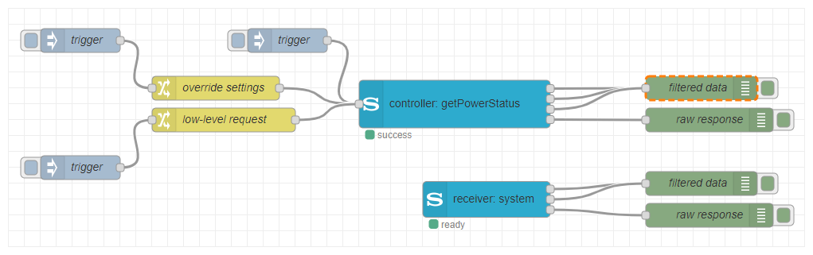

# node-red-contrib-sony-audio
A collection of Node-RED nodes to control Sony audio devices via the Sony Audio Control API.

With these nodes you can connect to your Sony audio devices and send control commands (like powering on/off, change volume etc.), retrieve information (like the current volume, the current value of a sound setting etc.) or get notified of certain events (like a change of the power state, a change of the mute state etc.).

If you would like to propose a new feature or any kind of improvement or if you want to report a bug, don't hesitate to create an issue in the [issue tracker](https://github.com/jensrossbach/node-red-contrib-sony-audio/issues) of the repository on GitHub.

## Documentation
This package is the successor of the [node-red-contrib-sony-audio-control](https://github.com/jensrossbach/node-red-contrib-sony-audio-control) node collection. It contains new powerful flow nodes providing the same and more functionality and flexibility as the old package.

The detailed documentation which explains the configuration of the nodes and utilization of input and output messages is available in the wiki of the GitHub repository.

**&rarr; [Documentation Wiki](https://github.com/jensrossbach/node-red-contrib-sony-audio/wiki)**

## License
Copyright (c) 2020 Jens-Uwe Rossbach

This code is licensed under the MIT License.

Permission is hereby granted, free of charge, to any person obtaining a copy
of this software and associated documentation files (the "Software"), to deal
in the Software without restriction, including without limitation the rights
to use, copy, modify, merge, publish, distribute, sublicense, and/or sell
copies of the Software, and to permit persons to whom the Software is
furnished to do so, subject to the following conditions:

The above copyright notice and this permission notice shall be included in all
copies or substantial portions of the Software.

THE SOFTWARE IS PROVIDED "AS IS", WITHOUT WARRANTY OF ANY KIND, EXPRESS OR
IMPLIED, INCLUDING BUT NOT LIMITED TO THE WARRANTIES OF MERCHANTABILITY,
FITNESS FOR A PARTICULAR PURPOSE AND NONINFRINGEMENT. IN NO EVENT SHALL THE
AUTHORS OR COPYRIGHT HOLDERS BE LIABLE FOR ANY CLAIM, DAMAGES OR OTHER
LIABILITY, WHETHER IN AN ACTION OF CONTRACT, TORT OR OTHERWISE, ARISING FROM,
OUT OF OR IN CONNECTION WITH THE SOFTWARE OR THE USE OR OTHER DEALINGS IN THE
SOFTWARE.

## Sony Legal Information
### Trademark
The trademark "SONY" and any other product names, service names or logos of SONY used, quoted and/or referenced in this Web Site are trademarks or registered trademarks of Sony Corporation or any of its affiliates.

### License Audio Control API
Copyright (c) 2020 Sony Corporation. All rights reserved.

The 'Audio Control API' is licensed to the user by Sony Video & Sound products Inc. under the license terms of the [Creative Commons Attribution-NoDerivatives 4.0 International Public License](https://creativecommons.org/licenses/by-nd/4.0/legalcode).

For more information, see the official web site of the Sony [Audio Control API](https://developer.sony.com/develop/audio-control-api).